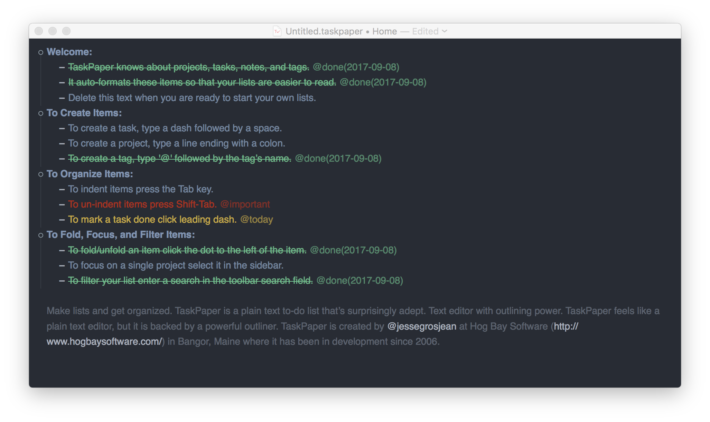

# TaskPaper Theme

This is a simple and clean theme for [TaskPaper 3.5](https://www.taskpaper.com). TaskPaper is a simple plaintext to-do list that can also be used as a note editor.



## Usage

1. Download the TaskPaper.app theme.
2. Open the TaskPaper.app and go to **Window** > **Stylesheet** > **Open Stylesheet Folder**.
3. Move the downloaded `Dark.less` theme into the **Stylesheet Folder**.
4. Activate the theme at **Window** > **Stylesheet** > **Dark.less**.

## Additional Information

You can change the theme as much as you want, the documentation of TaskPaper is available at [www.guide.taskpaper.com](https://guide.taskpaper.com/getting-started/) and allows a lot of customisations. Since I keep the setup as simple as possible, I have decided on three tags that can be used.

| Tag |
| --- |
| `@today` |
| `@important` |
| `@done` |

In order to add new tags, open the Dark.less file in an editor and add the following lines. Replace the **tag** in `item[data-tag]` to the one you want to create, change the color and save the file.

```less
// TAGS

/* @tag */
item[data-tag] {
  > run[content] {
    text-strikethrough-color: RGBA(115, 195, 143, 1.00);
    color: fade(RGBA(115, 195, 143, 1.00), 90%);
  }
  > run[tag] {
    color: fade(RGBA(115, 195, 143, 1.00), 60%);
  }
}
```
